# ERD hệ thống JLSP

Nền tảng học tiếng Nhật qua video ngắn · PostgreSQL (Supabase) · 31 bảng đang dùng.

Sinh từ các entity Java trên nhánh `feature/auth-refactor` (cộng bảng chủ đề/hashtag của `dev`). Mermaid được GitHub vẽ trực tiếp; dán mã vào <https://mermaid.live> để xuất ảnh SVG/PNG.

**Ký hiệu quan hệ:** `||` đúng một · `|o` không hoặc một · `o{` không hoặc nhiều · `--` có khóa ngoại thật · `..` tham chiếu logic (không có ràng buộc khóa ngoại).

## Conceptual ERD

Mức khái niệm: chỉ có thực thể nghiệp vụ và quan hệ giữa chúng, không có thuộc tính hay khóa. Quan hệ nhiều-nhiều được giữ nguyên (chưa tách thành bảng trung gian).

### Toàn hệ thống

_Tất cả thực thể nghiệp vụ và quan hệ giữa chúng._

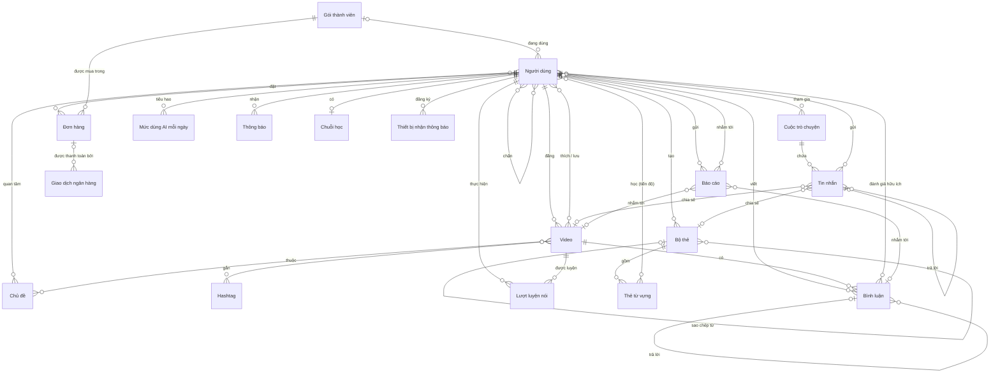
```mermaid
erDiagram
    "Người dùng" ||--o{ "Video" : "đăng"
    "Người dùng" }o--o{ "Người dùng" : "theo dõi"
    "Người dùng" }o--o{ "Người dùng" : "chặn"
    "Người dùng" }o--o{ "Chủ đề" : "quan tâm"
    "Video" }o--o{ "Chủ đề" : "thuộc"
    "Video" }o--o{ "Hashtag" : "gắn"
    "Người dùng" }o--o{ "Video" : "thích / lưu"
    "Người dùng" ||--o{ "Bình luận" : "viết"
    "Video" ||--o{ "Bình luận" : "có"
    "Bình luận" |o--o{ "Bình luận" : "trả lời"
    "Người dùng" }o--o{ "Bình luận" : "đánh giá hữu ích"
    "Người dùng" ||--o{ "Lượt luyện nói" : "thực hiện"
    "Video" ||--o{ "Lượt luyện nói" : "được luyện"
    "Người dùng" ||--o{ "Bộ thẻ" : "tạo"
    "Bộ thẻ" ||--o{ "Thẻ từ vựng" : "gồm"
    "Bộ thẻ" |o--o{ "Bộ thẻ" : "sao chép từ"
    "Người dùng" }o--o{ "Thẻ từ vựng" : "học (tiến độ)"
    "Người dùng" }o--o{ "Cuộc trò chuyện" : "tham gia"
    "Cuộc trò chuyện" ||--o{ "Tin nhắn" : "chứa"
    "Người dùng" ||--o{ "Tin nhắn" : "gửi"
    "Tin nhắn" |o--o{ "Tin nhắn" : "trả lời"
    "Tin nhắn" }o--o| "Video" : "chia sẻ"
    "Tin nhắn" }o--o| "Bộ thẻ" : "chia sẻ"
    "Gói thành viên" |o--o{ "Người dùng" : "đang dùng"
    "Người dùng" ||--o{ "Đơn hàng" : "đặt"
    "Gói thành viên" ||--o{ "Đơn hàng" : "được mua trong"
    "Đơn hàng" |o--o{ "Giao dịch ngân hàng" : "được thanh toán bởi"
    "Người dùng" ||--o{ "Mức dùng AI mỗi ngày" : "tiêu hao"
    "Người dùng" ||--o{ "Thông báo" : "nhận"
    "Người dùng" ||--o{ "Báo cáo" : "gửi"
    "Báo cáo" }o--o| "Video" : "nhắm tới"
    "Báo cáo" }o--o| "Bình luận" : "nhắm tới"
    "Báo cáo" }o--o| "Người dùng" : "nhắm tới"
    "Người dùng" ||--o| "Chuỗi học" : "có"
    "Người dùng" ||--o{ "Thiết bị nhận thông báo" : "đăng ký"
```

### Người dùng & xã hội

_Các quan hệ liên quan tới nhóm này._

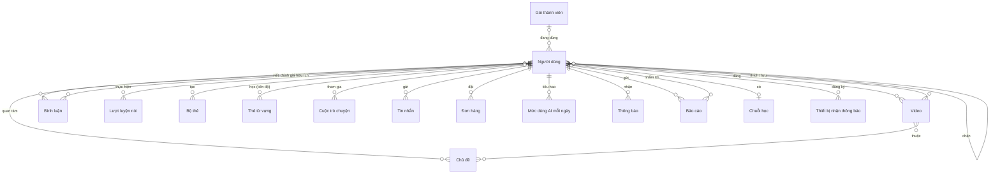
```mermaid
erDiagram
    "Người dùng" ||--o{ "Video" : "đăng"
    "Người dùng" }o--o{ "Người dùng" : "theo dõi"
    "Người dùng" }o--o{ "Người dùng" : "chặn"
    "Người dùng" }o--o{ "Chủ đề" : "quan tâm"
    "Video" }o--o{ "Chủ đề" : "thuộc"
    "Người dùng" }o--o{ "Video" : "thích / lưu"
    "Người dùng" ||--o{ "Bình luận" : "viết"
    "Người dùng" }o--o{ "Bình luận" : "đánh giá hữu ích"
    "Người dùng" ||--o{ "Lượt luyện nói" : "thực hiện"
    "Người dùng" ||--o{ "Bộ thẻ" : "tạo"
    "Người dùng" }o--o{ "Thẻ từ vựng" : "học (tiến độ)"
    "Người dùng" }o--o{ "Cuộc trò chuyện" : "tham gia"
    "Người dùng" ||--o{ "Tin nhắn" : "gửi"
    "Gói thành viên" |o--o{ "Người dùng" : "đang dùng"
    "Người dùng" ||--o{ "Đơn hàng" : "đặt"
    "Người dùng" ||--o{ "Mức dùng AI mỗi ngày" : "tiêu hao"
    "Người dùng" ||--o{ "Thông báo" : "nhận"
    "Người dùng" ||--o{ "Báo cáo" : "gửi"
    "Báo cáo" }o--o| "Người dùng" : "nhắm tới"
    "Người dùng" ||--o| "Chuỗi học" : "có"
    "Người dùng" ||--o{ "Thiết bị nhận thông báo" : "đăng ký"
```

### Video & tương tác

_Các quan hệ liên quan tới nhóm này._

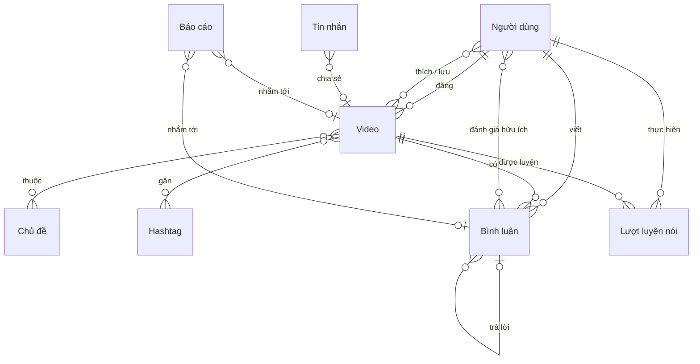
```mermaid
erDiagram
    "Người dùng" ||--o{ "Video" : "đăng"
    "Video" }o--o{ "Chủ đề" : "thuộc"
    "Video" }o--o{ "Hashtag" : "gắn"
    "Người dùng" }o--o{ "Video" : "thích / lưu"
    "Người dùng" ||--o{ "Bình luận" : "viết"
    "Video" ||--o{ "Bình luận" : "có"
    "Bình luận" |o--o{ "Bình luận" : "trả lời"
    "Người dùng" }o--o{ "Bình luận" : "đánh giá hữu ích"
    "Người dùng" ||--o{ "Lượt luyện nói" : "thực hiện"
    "Video" ||--o{ "Lượt luyện nói" : "được luyện"
    "Tin nhắn" }o--o| "Video" : "chia sẻ"
    "Báo cáo" }o--o| "Video" : "nhắm tới"
    "Báo cáo" }o--o| "Bình luận" : "nhắm tới"
```

### Flashcard

_Các quan hệ liên quan tới nhóm này._

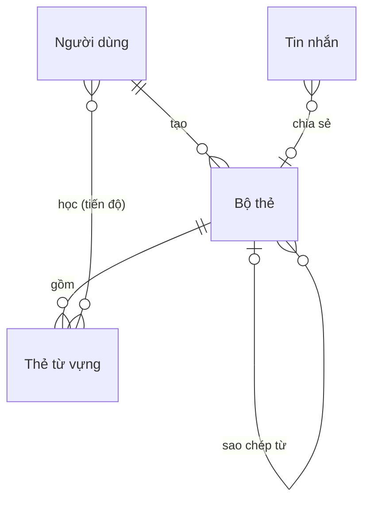
```mermaid
erDiagram
    "Người dùng" ||--o{ "Bộ thẻ" : "tạo"
    "Bộ thẻ" ||--o{ "Thẻ từ vựng" : "gồm"
    "Bộ thẻ" |o--o{ "Bộ thẻ" : "sao chép từ"
    "Người dùng" }o--o{ "Thẻ từ vựng" : "học (tiến độ)"
    "Tin nhắn" }o--o| "Bộ thẻ" : "chia sẻ"
```

### Trò chuyện

_Các quan hệ liên quan tới nhóm này._

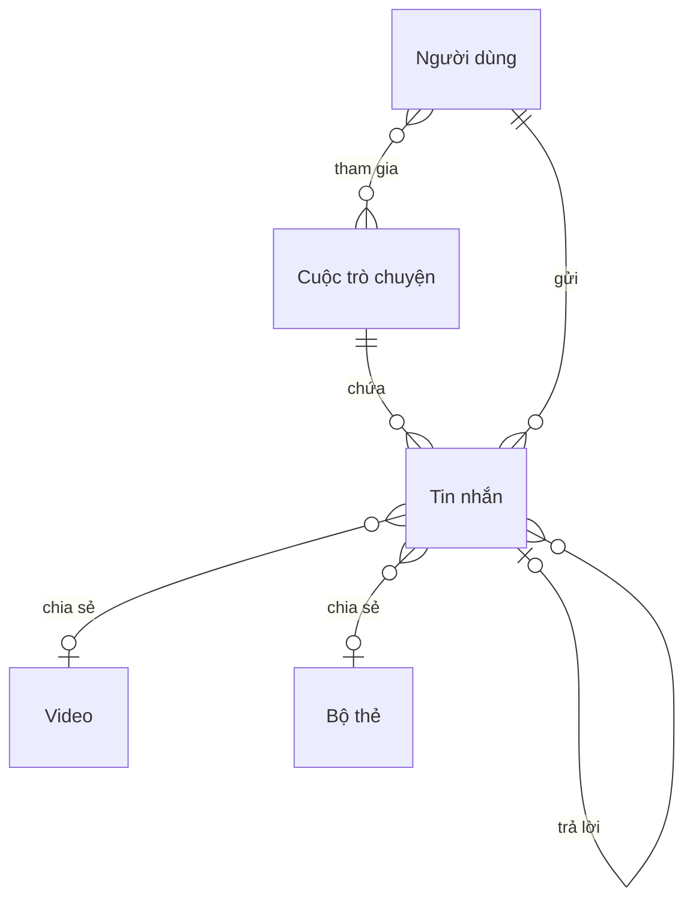
```mermaid
erDiagram
    "Người dùng" }o--o{ "Cuộc trò chuyện" : "tham gia"
    "Cuộc trò chuyện" ||--o{ "Tin nhắn" : "chứa"
    "Người dùng" ||--o{ "Tin nhắn" : "gửi"
    "Tin nhắn" |o--o{ "Tin nhắn" : "trả lời"
    "Tin nhắn" }o--o| "Video" : "chia sẻ"
    "Tin nhắn" }o--o| "Bộ thẻ" : "chia sẻ"
```

### Gói & thanh toán

_Các quan hệ liên quan tới nhóm này._

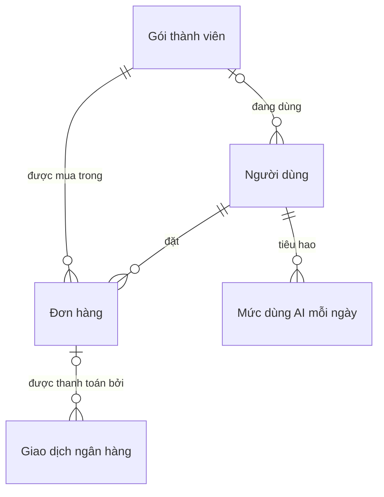
```mermaid
erDiagram
    "Gói thành viên" |o--o{ "Người dùng" : "đang dùng"
    "Người dùng" ||--o{ "Đơn hàng" : "đặt"
    "Gói thành viên" ||--o{ "Đơn hàng" : "được mua trong"
    "Đơn hàng" |o--o{ "Giao dịch ngân hàng" : "được thanh toán bởi"
    "Người dùng" ||--o{ "Mức dùng AI mỗi ngày" : "tiêu hao"
```

### Kiểm duyệt & thông báo

_Các quan hệ liên quan tới nhóm này._

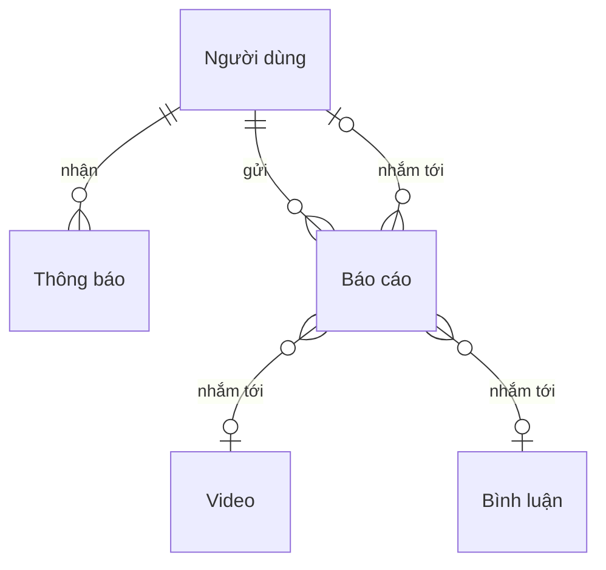
```mermaid
erDiagram
    "Người dùng" ||--o{ "Thông báo" : "nhận"
    "Người dùng" ||--o{ "Báo cáo" : "gửi"
    "Báo cáo" }o--o| "Video" : "nhắm tới"
    "Báo cáo" }o--o| "Bình luận" : "nhắm tới"
    "Báo cáo" }o--o| "Người dùng" : "nhắm tới"
```

## Logical ERD

Mức logic: thêm thuộc tính, khóa chính và khóa ngoại, quan hệ nhiều-nhiều đã tách thành thực thể trung gian. Kiểu dữ liệu ở mức tổng quát (string, int, datetime…), chưa phụ thuộc hệ quản trị CSDL.

### Toàn hệ thống

_Chỉ tên thực thể và quan hệ, để thấy cả bản đồ._

```mermaid
erDiagram
    User ||--o{ Video : userId
    User ||--o{ VideoComment : userId
    Video ||--o{ VideoComment : videoId
    VideoComment |o--o{ VideoComment : parentId
    VideoComment |o--o{ VideoComment : replyToId
    User ||--o{ VideoLike : userId
    Video ||--o{ VideoLike : videoId
    User ||--o{ VideoSave : userId
    Video ||--o{ VideoSave : videoId
    User ||--o{ CommentLike : userId
    VideoComment ||--o{ CommentLike : commentId
    User ||--o{ ShadowingPractice : userId
    Video ||--o{ ShadowingPractice : videoId
    User ||--o{ ShadowingLineAttempt : userId
    Video ||--o{ ShadowingLineAttempt : videoId
    Video ||--o{ VideoTopic : videoId
    Topic ||--o{ VideoTopic : topicId
    Video ||--o{ VideoHashtag : videoId
    Hashtag ||--o{ VideoHashtag : hashtagId
    User ||--o{ UserTopic : userId
    Topic ||--o{ UserTopic : topicId
    User ||--o{ Follow : followerId
    User ||--o{ Follow : followingId
    User ||--o{ UserBlock : blockerId
    User ||--o{ UserBlock : blockedId
    User ||..o| UserStreak : userId
    User ||..o{ UserStreakDay : userId
    User ||--o{ DeviceToken : userId
    User ||--o{ FlashcardSet : userId
    FlashcardSet ||--o{ Flashcard : setId
    User ||--o{ FlashcardProgress : userId
    Flashcard ||--o{ FlashcardProgress : cardId
    FlashcardSet |o..o{ FlashcardSet : sourceSetId
    User ||--o{ Conversation : userLowId
    User ||--o{ Conversation : userHighId
    Conversation ||--o{ Message : conversationId
    User ||--o{ Message : senderId
    Message |o--o{ Message : replyToId
    Message |o--o| Conversation : lastMessageId
    Conversation ||--o{ ConversationParticipant : conversationId
    User ||--o{ ConversationParticipant : userId
    Video |o..o{ Message : videoId
    FlashcardSet |o..o{ Message : deckId
    SubscriptionPlan |o--o{ User : subscriptionPlanId
    SubscriptionPlan ||--o{ SubscriptionOrder : planId
    User ||--o{ SubscriptionOrder : userId
    SubscriptionOrder |o..o{ PaymentTransaction : orderId
    User ||--o{ DailyTokenUsage : userId
    User ||--o{ Report : reporterId
    User ||--o{ Notification : recipientId
    User |o--o{ Notification : actorId
    Video |o..o{ Notification : videoId
    VideoComment |o..o{ Notification : commentId
    User |o..o{ Video : moderatedBy
    User |o..o{ Report : resolvedBy
    User |o..o{ SubscriptionOrder : confirmedBy
```

### Người dùng & quan hệ xã hội

_8 thực thể; ô không có thuộc tính là thực thể của nhóm khác._

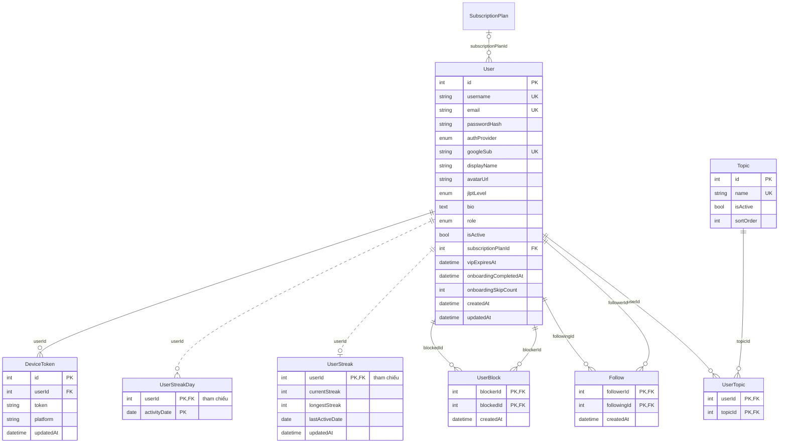
```mermaid
erDiagram
    User {
        int id PK
        string username UK
        string email UK
        string passwordHash
        enum authProvider
        string googleSub UK
        string displayName
        string avatarUrl
        enum jlptLevel
        text bio
        enum role
        bool isActive
        int subscriptionPlanId FK
        datetime vipExpiresAt
        datetime onboardingCompletedAt
        int onboardingSkipCount
        datetime createdAt
        datetime updatedAt
    }
    Follow {
        int followerId PK, FK
        int followingId PK, FK
        datetime createdAt
    }
    UserBlock {
        int blockerId PK, FK
        int blockedId PK, FK
        datetime createdAt
    }
    Topic {
        int id PK
        string name UK
        bool isActive
        int sortOrder
    }
    UserTopic {
        int userId PK, FK
        int topicId PK, FK
    }
    UserStreak {
        int userId PK, FK "tham chiếu"
        int currentStreak
        int longestStreak
        date lastActiveDate
        datetime updatedAt
    }
    UserStreakDay {
        int userId PK, FK "tham chiếu"
        date activityDate PK
    }
    DeviceToken {
        int id PK
        int userId FK
        string token
        string platform
        datetime updatedAt
    }
    User ||--o{ UserTopic : userId
    Topic ||--o{ UserTopic : topicId
    User ||--o{ Follow : followerId
    User ||--o{ Follow : followingId
    User ||--o{ UserBlock : blockerId
    User ||--o{ UserBlock : blockedId
    User ||..o| UserStreak : userId
    User ||..o{ UserStreakDay : userId
    User ||--o{ DeviceToken : userId
    SubscriptionPlan |o--o{ User : subscriptionPlanId
```

### Video & tương tác

_10 thực thể; ô không có thuộc tính là thực thể của nhóm khác._

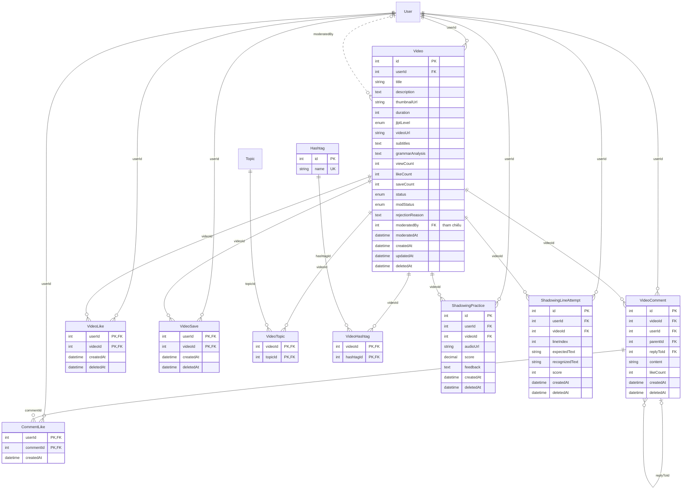
```mermaid
erDiagram
    Video {
        int id PK
        int userId FK
        string title
        text description
        string thumbnailUrl
        int duration
        enum jlptLevel
        string videoUrl
        text subtitles
        text grammarAnalysis
        int viewCount
        int likeCount
        int saveCount
        enum status
        enum modStatus
        text rejectionReason
        int moderatedBy FK "tham chiếu"
        datetime moderatedAt
        datetime createdAt
        datetime updatedAt
        datetime deletedAt
    }
    VideoComment {
        int id PK
        int videoId FK
        int userId FK
        int parentId FK
        int replyToId FK
        string content
        int likeCount
        datetime createdAt
        datetime deletedAt
    }
    CommentLike {
        int userId PK, FK
        int commentId PK, FK
        datetime createdAt
    }
    VideoLike {
        int userId PK, FK
        int videoId PK, FK
        datetime createdAt
        datetime deletedAt
    }
    VideoSave {
        int userId PK, FK
        int videoId PK, FK
        datetime createdAt
        datetime deletedAt
    }
    VideoTopic {
        int videoId PK, FK
        int topicId PK, FK
    }
    Hashtag {
        int id PK
        string name UK
    }
    VideoHashtag {
        int videoId PK, FK
        int hashtagId PK, FK
    }
    ShadowingPractice {
        int id PK
        int userId FK
        int videoId FK
        string audioUrl
        decimal score
        text feedback
        datetime createdAt
        datetime deletedAt
    }
    ShadowingLineAttempt {
        int id PK
        int userId FK
        int videoId FK
        int lineIndex
        string expectedText
        string recognizedText
        int score
        datetime createdAt
        datetime deletedAt
    }
    User ||--o{ Video : userId
    User ||--o{ VideoComment : userId
    Video ||--o{ VideoComment : videoId
    VideoComment |o--o{ VideoComment : parentId
    VideoComment |o--o{ VideoComment : replyToId
    User ||--o{ VideoLike : userId
    Video ||--o{ VideoLike : videoId
    User ||--o{ VideoSave : userId
    Video ||--o{ VideoSave : videoId
    User ||--o{ CommentLike : userId
    VideoComment ||--o{ CommentLike : commentId
    User ||--o{ ShadowingPractice : userId
    Video ||--o{ ShadowingPractice : videoId
    User ||--o{ ShadowingLineAttempt : userId
    Video ||--o{ ShadowingLineAttempt : videoId
    Video ||--o{ VideoTopic : videoId
    Topic ||--o{ VideoTopic : topicId
    Video ||--o{ VideoHashtag : videoId
    Hashtag ||--o{ VideoHashtag : hashtagId
    User |o..o{ Video : moderatedBy
```

### Flashcard & học tập

_3 thực thể; ô không có thuộc tính là thực thể của nhóm khác._

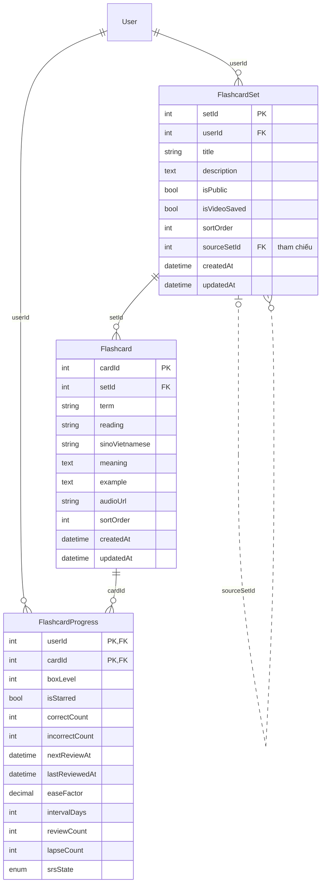
```mermaid
erDiagram
    FlashcardSet {
        int setId PK
        int userId FK
        string title
        text description
        bool isPublic
        bool isVideoSaved
        int sortOrder
        int sourceSetId FK "tham chiếu"
        datetime createdAt
        datetime updatedAt
    }
    Flashcard {
        int cardId PK
        int setId FK
        string term
        string reading
        string sinoVietnamese
        text meaning
        text example
        string audioUrl
        int sortOrder
        datetime createdAt
        datetime updatedAt
    }
    FlashcardProgress {
        int userId PK, FK
        int cardId PK, FK
        int boxLevel
        bool isStarred
        int correctCount
        int incorrectCount
        datetime nextReviewAt
        datetime lastReviewedAt
        decimal easeFactor
        int intervalDays
        int reviewCount
        int lapseCount
        enum srsState
    }
    User ||--o{ FlashcardSet : userId
    FlashcardSet ||--o{ Flashcard : setId
    User ||--o{ FlashcardProgress : userId
    Flashcard ||--o{ FlashcardProgress : cardId
    FlashcardSet |o..o{ FlashcardSet : sourceSetId
```

### Trò chuyện

_3 thực thể; ô không có thuộc tính là thực thể của nhóm khác._

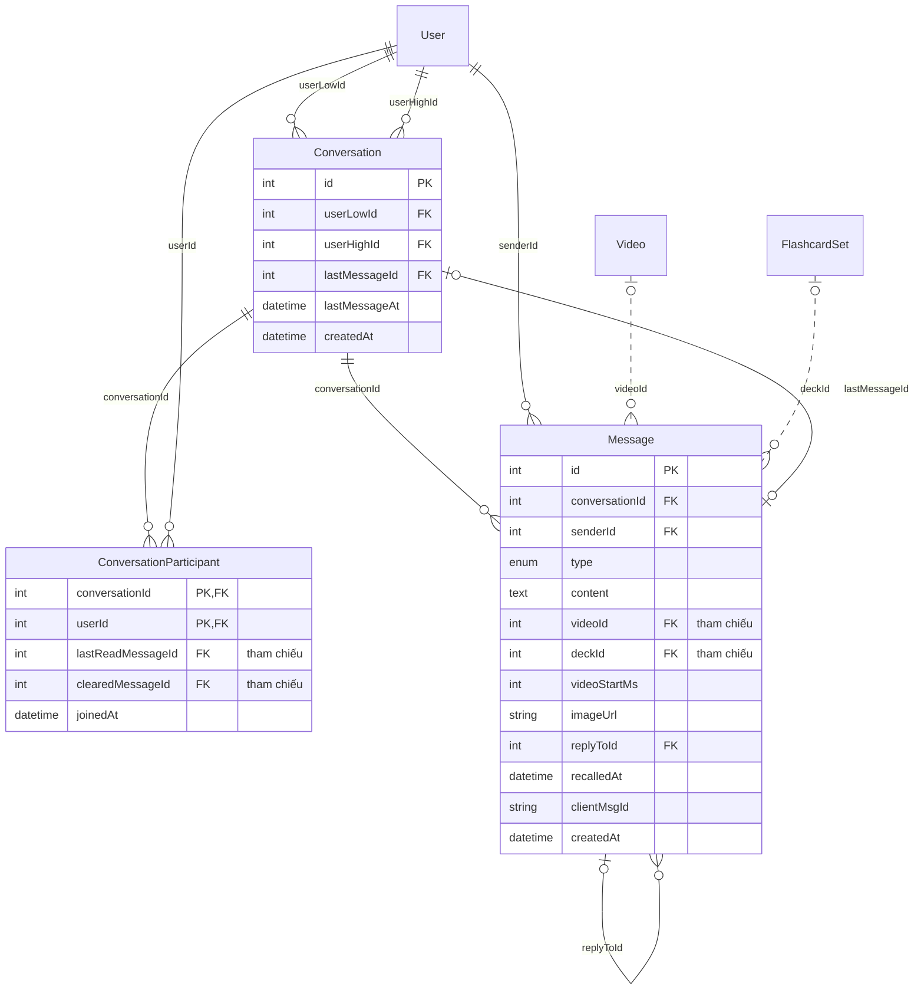
```mermaid
erDiagram
    Conversation {
        int id PK
        int userLowId FK
        int userHighId FK
        int lastMessageId FK
        datetime lastMessageAt
        datetime createdAt
    }
    ConversationParticipant {
        int conversationId PK, FK
        int userId PK, FK
        int lastReadMessageId FK "tham chiếu"
        int clearedMessageId FK "tham chiếu"
        datetime joinedAt
    }
    Message {
        int id PK
        int conversationId FK
        int senderId FK
        enum type
        text content
        int videoId FK "tham chiếu"
        int deckId FK "tham chiếu"
        int videoStartMs
        string imageUrl
        int replyToId FK
        datetime recalledAt
        string clientMsgId
        datetime createdAt
    }
    User ||--o{ Conversation : userLowId
    User ||--o{ Conversation : userHighId
    Conversation ||--o{ Message : conversationId
    User ||--o{ Message : senderId
    Message |o--o{ Message : replyToId
    Message |o--o| Conversation : lastMessageId
    Conversation ||--o{ ConversationParticipant : conversationId
    User ||--o{ ConversationParticipant : userId
    Video |o..o{ Message : videoId
    FlashcardSet |o..o{ Message : deckId
```

### Gói thành viên & thanh toán

_5 thực thể; ô không có thuộc tính là thực thể của nhóm khác._

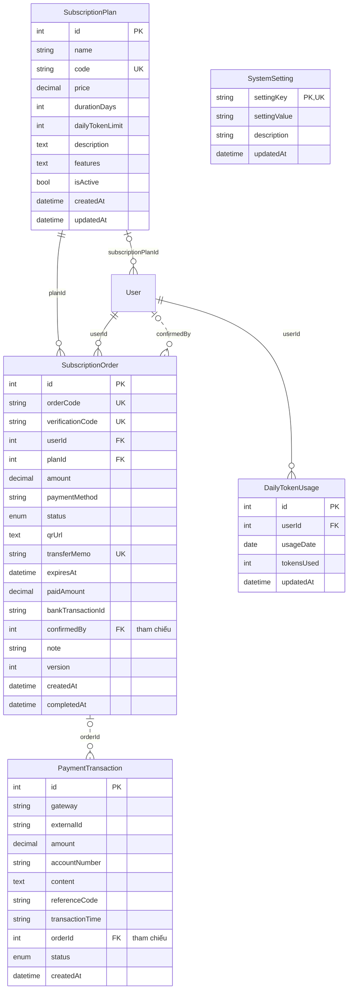
```mermaid
erDiagram
    SubscriptionPlan {
        int id PK
        string name
        string code UK
        decimal price
        int durationDays
        int dailyTokenLimit
        text description
        text features
        bool isActive
        datetime createdAt
        datetime updatedAt
    }
    SubscriptionOrder {
        int id PK
        string orderCode UK
        string verificationCode UK
        int userId FK
        int planId FK
        decimal amount
        string paymentMethod
        enum status
        text qrUrl
        string transferMemo UK
        datetime expiresAt
        decimal paidAmount
        string bankTransactionId
        int confirmedBy FK "tham chiếu"
        string note
        int version
        datetime createdAt
        datetime completedAt
    }
    PaymentTransaction {
        int id PK
        string gateway
        string externalId
        decimal amount
        string accountNumber
        text content
        string referenceCode
        string transactionTime
        int orderId FK "tham chiếu"
        enum status
        datetime createdAt
    }
    DailyTokenUsage {
        int id PK
        int userId FK
        date usageDate
        int tokensUsed
        datetime updatedAt
    }
    SystemSetting {
        string settingKey PK, UK
        string settingValue
        string description
        datetime updatedAt
    }
    SubscriptionPlan |o--o{ User : subscriptionPlanId
    SubscriptionPlan ||--o{ SubscriptionOrder : planId
    User ||--o{ SubscriptionOrder : userId
    SubscriptionOrder |o..o{ PaymentTransaction : orderId
    User ||--o{ DailyTokenUsage : userId
    User |o..o{ SubscriptionOrder : confirmedBy
```

### Báo cáo & thông báo

_2 thực thể; ô không có thuộc tính là thực thể của nhóm khác._

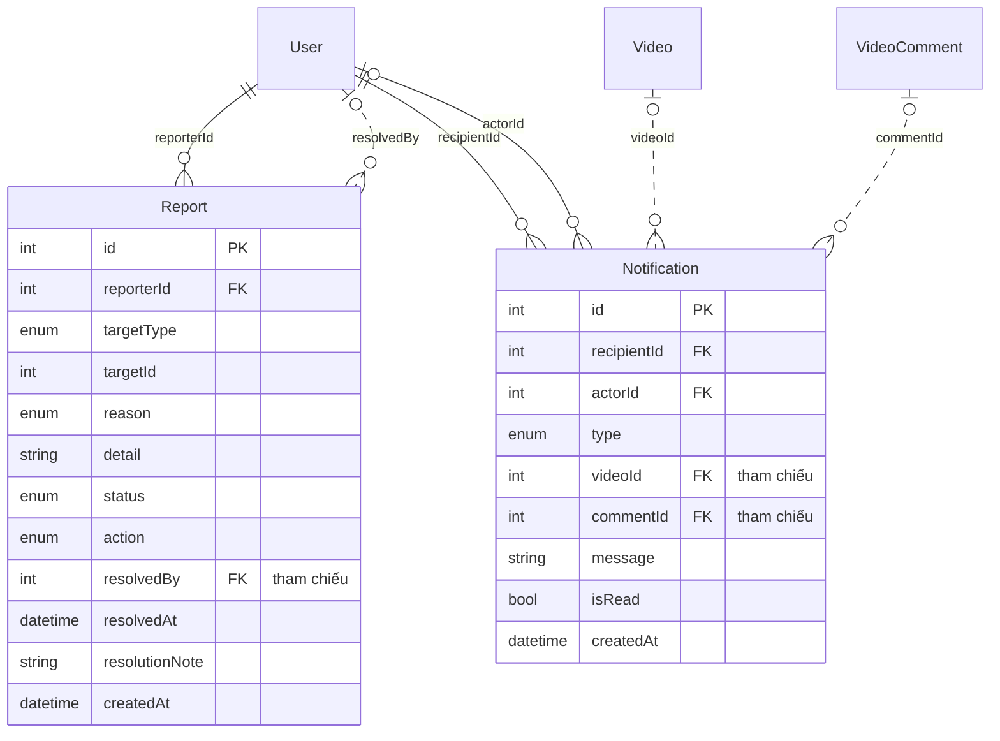
```mermaid
erDiagram
    Report {
        int id PK
        int reporterId FK
        enum targetType
        int targetId
        enum reason
        string detail
        enum status
        enum action
        int resolvedBy FK "tham chiếu"
        datetime resolvedAt
        string resolutionNote
        datetime createdAt
    }
    Notification {
        int id PK
        int recipientId FK
        int actorId FK
        enum type
        int videoId FK "tham chiếu"
        int commentId FK "tham chiếu"
        string message
        bool isRead
        datetime createdAt
    }
    User ||--o{ Report : reporterId
    User ||--o{ Notification : recipientId
    User |o--o{ Notification : actorId
    Video |o..o{ Notification : videoId
    VideoComment |o..o{ Notification : commentId
    User |o..o{ Report : resolvedBy
```

## Physical ERD

Mức vật lý: đúng các bảng PostgreSQL mà hệ thống tạo ra, gồm tên bảng/cột, kiểu dữ liệu, khóa chính, khóa ngoại và khóa duy nhất. NN là NOT NULL.

### Toàn hệ thống

_Chỉ tên bảng và khóa ngoại, để thấy cả bản đồ._

```mermaid
erDiagram
    users ||--o{ videos : user_id
    users ||--o{ video_comments : user_id
    videos ||--o{ video_comments : video_id
    video_comments |o--o{ video_comments : parent_id
    video_comments |o--o{ video_comments : reply_to_id
    users ||--o{ video_likes : user_id
    videos ||--o{ video_likes : video_id
    users ||--o{ video_saves : user_id
    videos ||--o{ video_saves : video_id
    users ||--o{ comment_likes : user_id
    video_comments ||--o{ comment_likes : comment_id
    users ||--o{ shadowing_practice : user_id
    videos ||--o{ shadowing_practice : video_id
    users ||--o{ shadowing_line_attempts : user_id
    videos ||--o{ shadowing_line_attempts : video_id
    videos ||--o{ video_topics : video_id
    topics ||--o{ video_topics : topic_id
    videos ||--o{ video_hashtags : video_id
    hashtags ||--o{ video_hashtags : hashtag_id
    users ||--o{ user_topics : user_id
    topics ||--o{ user_topics : topic_id
    users ||--o{ follows : follower_id
    users ||--o{ follows : following_id
    users ||--o{ user_blocks : blocker_id
    users ||--o{ user_blocks : blocked_id
    users ||..o| user_streaks : "user_id (không FK)"
    users ||..o{ user_streak_days : "user_id (không FK)"
    users ||--o{ device_tokens : user_id
    users ||--o{ flashcard_sets : user_id
    flashcard_sets ||--o{ flashcards : set_id
    users ||--o{ flashcard_progress : user_id
    flashcards ||--o{ flashcard_progress : card_id
    flashcard_sets |o..o{ flashcard_sets : "source_set_id (không FK)"
    users ||--o{ conversations : user_low_id
    users ||--o{ conversations : user_high_id
    conversations ||--o{ messages : conversation_id
    users ||--o{ messages : sender_id
    messages |o--o{ messages : reply_to_id
    messages |o--o| conversations : last_message_id
    conversations ||--o{ conversation_participants : conversation_id
    users ||--o{ conversation_participants : user_id
    videos |o..o{ messages : "video_id (không FK)"
    flashcard_sets |o..o{ messages : "deck_id (không FK)"
    subscription_plans |o--o{ users : subscription_plan_id
    subscription_plans ||--o{ subscription_orders : plan_id
    users ||--o{ subscription_orders : user_id
    subscription_orders |o..o{ payment_transactions : "order_id (không FK)"
    users ||--o{ user_daily_token_usage : user_id
    users ||--o{ reports : reporter_id
    users ||--o{ notifications : recipient_id
    users |o--o{ notifications : actor_id
    videos |o..o{ notifications : "video_id (không FK)"
    video_comments |o..o{ notifications : "comment_id (không FK)"
    users |o..o{ videos : "moderated_by (không FK)"
    users |o..o{ reports : "resolved_by (không FK)"
    users |o..o{ subscription_orders : "confirmed_by (không FK)"
```

### Người dùng & quan hệ xã hội

_8 bảng; ô không có cột là bảng của nhóm khác._

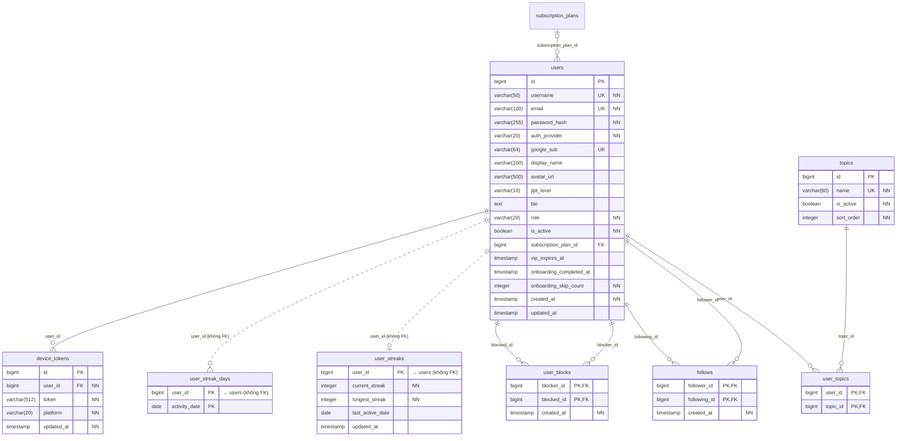
```mermaid
erDiagram
    users {
        bigint id PK
        varchar(50) username UK "NN"
        varchar(100) email UK "NN"
        varchar(255) password_hash "NN"
        varchar(20) auth_provider "NN"
        varchar(64) google_sub UK
        varchar(100) display_name
        varchar(500) avatar_url
        varchar(10) jlpt_level
        text bio
        varchar(20) role "NN"
        boolean is_active "NN"
        bigint subscription_plan_id FK
        timestamp vip_expires_at
        timestamp onboarding_completed_at
        integer onboarding_skip_count "NN"
        timestamp created_at "NN"
        timestamp updated_at
    }
    follows {
        bigint follower_id PK, FK
        bigint following_id PK, FK
        timestamp created_at "NN"
    }
    user_blocks {
        bigint blocker_id PK, FK
        bigint blocked_id PK, FK
        timestamp created_at "NN"
    }
    topics {
        bigint id PK
        varchar(80) name UK "NN"
        boolean is_active "NN"
        integer sort_order "NN"
    }
    user_topics {
        bigint user_id PK, FK
        bigint topic_id PK, FK
    }
    user_streaks {
        bigint user_id PK "→ users (không FK)"
        integer current_streak "NN"
        integer longest_streak "NN"
        date last_active_date
        timestamp updated_at
    }
    user_streak_days {
        bigint user_id PK "→ users (không FK)"
        date activity_date PK
    }
    device_tokens {
        bigint id PK
        bigint user_id FK "NN"
        varchar(512) token "NN"
        varchar(20) platform "NN"
        timestamp updated_at "NN"
    }
    users ||--o{ user_topics : user_id
    topics ||--o{ user_topics : topic_id
    users ||--o{ follows : follower_id
    users ||--o{ follows : following_id
    users ||--o{ user_blocks : blocker_id
    users ||--o{ user_blocks : blocked_id
    users ||..o| user_streaks : "user_id (không FK)"
    users ||..o{ user_streak_days : "user_id (không FK)"
    users ||--o{ device_tokens : user_id
    subscription_plans |o--o{ users : subscription_plan_id
```

### Video & tương tác

_10 bảng; ô không có cột là bảng của nhóm khác._

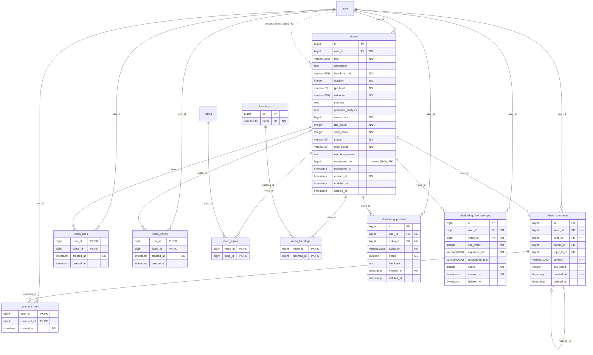
```mermaid
erDiagram
    videos {
        bigint id PK
        bigint user_id FK "NN"
        varchar(255) title "NN"
        text description
        varchar(255) thumbnail_url "NN"
        integer duration "NN"
        varchar(10) jlpt_level "NN"
        varchar(255) video_url "NN"
        text subtitles
        text grammar_analysis
        bigint view_count "NN"
        integer like_count "NN"
        integer save_count "NN"
        varchar(20) status "NN"
        varchar(20) mod_status "NN"
        text rejection_reason
        bigint moderated_by "→ users (không FK)"
        timestamp moderated_at
        timestamp created_at "NN"
        timestamp updated_at
        timestamp deleted_at
    }
    video_comments {
        bigint id PK
        bigint video_id FK "NN"
        bigint user_id FK "NN"
        bigint parent_id FK
        bigint reply_to_id FK
        varchar(1000) content "NN"
        integer like_count "NN"
        timestamp created_at "NN"
        timestamp deleted_at
    }
    comment_likes {
        bigint user_id PK, FK
        bigint comment_id PK, FK
        timestamp created_at "NN"
    }
    video_likes {
        bigint user_id PK, FK
        bigint video_id PK, FK
        timestamp created_at "NN"
        timestamp deleted_at
    }
    video_saves {
        bigint user_id PK, FK
        bigint video_id PK, FK
        timestamp created_at "NN"
        timestamp deleted_at
    }
    video_topics {
        bigint video_id PK, FK
        bigint topic_id PK, FK
    }
    hashtags {
        bigint id PK
        varchar(30) name UK "NN"
    }
    video_hashtags {
        bigint video_id PK, FK
        bigint hashtag_id PK, FK
    }
    shadowing_practice {
        bigint id PK
        bigint user_id FK "NN"
        bigint video_id FK "NN"
        varchar(255) audio_url "NN"
        numeric score "5,2"
        text feedback
        timestamp created_at "NN"
        timestamp deleted_at
    }
    shadowing_line_attempts {
        bigint id PK
        bigint user_id FK "NN"
        bigint video_id FK "NN"
        integer line_index "NN"
        varchar(1000) expected_text "NN"
        varchar(1000) recognized_text
        integer score "NN"
        timestamp created_at "NN"
        timestamp deleted_at
    }
    users ||--o{ videos : user_id
    users ||--o{ video_comments : user_id
    videos ||--o{ video_comments : video_id
    video_comments |o--o{ video_comments : parent_id
    video_comments |o--o{ video_comments : reply_to_id
    users ||--o{ video_likes : user_id
    videos ||--o{ video_likes : video_id
    users ||--o{ video_saves : user_id
    videos ||--o{ video_saves : video_id
    users ||--o{ comment_likes : user_id
    video_comments ||--o{ comment_likes : comment_id
    users ||--o{ shadowing_practice : user_id
    videos ||--o{ shadowing_practice : video_id
    users ||--o{ shadowing_line_attempts : user_id
    videos ||--o{ shadowing_line_attempts : video_id
    videos ||--o{ video_topics : video_id
    topics ||--o{ video_topics : topic_id
    videos ||--o{ video_hashtags : video_id
    hashtags ||--o{ video_hashtags : hashtag_id
    users |o..o{ videos : "moderated_by (không FK)"
```

### Flashcard & học tập

_3 bảng; ô không có cột là bảng của nhóm khác._

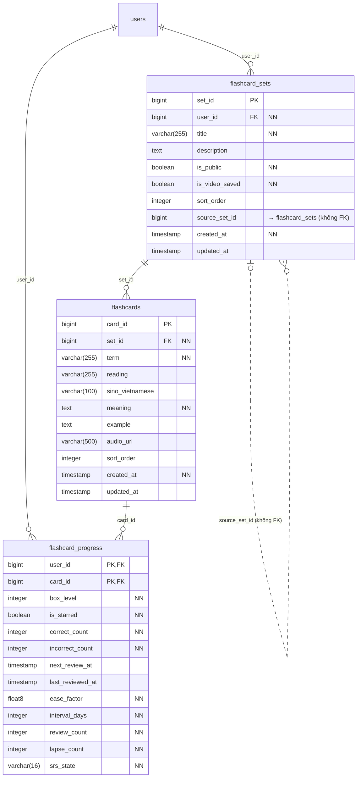
```mermaid
erDiagram
    flashcard_sets {
        bigint set_id PK
        bigint user_id FK "NN"
        varchar(255) title "NN"
        text description
        boolean is_public "NN"
        boolean is_video_saved "NN"
        integer sort_order
        bigint source_set_id "→ flashcard_sets (không FK)"
        timestamp created_at "NN"
        timestamp updated_at
    }
    flashcards {
        bigint card_id PK
        bigint set_id FK "NN"
        varchar(255) term "NN"
        varchar(255) reading
        varchar(100) sino_vietnamese
        text meaning "NN"
        text example
        varchar(500) audio_url
        integer sort_order
        timestamp created_at "NN"
        timestamp updated_at
    }
    flashcard_progress {
        bigint user_id PK, FK
        bigint card_id PK, FK
        integer box_level "NN"
        boolean is_starred "NN"
        integer correct_count "NN"
        integer incorrect_count "NN"
        timestamp next_review_at
        timestamp last_reviewed_at
        float8 ease_factor "NN"
        integer interval_days "NN"
        integer review_count "NN"
        integer lapse_count "NN"
        varchar(16) srs_state "NN"
    }
    users ||--o{ flashcard_sets : user_id
    flashcard_sets ||--o{ flashcards : set_id
    users ||--o{ flashcard_progress : user_id
    flashcards ||--o{ flashcard_progress : card_id
    flashcard_sets |o..o{ flashcard_sets : "source_set_id (không FK)"
```

### Trò chuyện

_3 bảng; ô không có cột là bảng của nhóm khác._

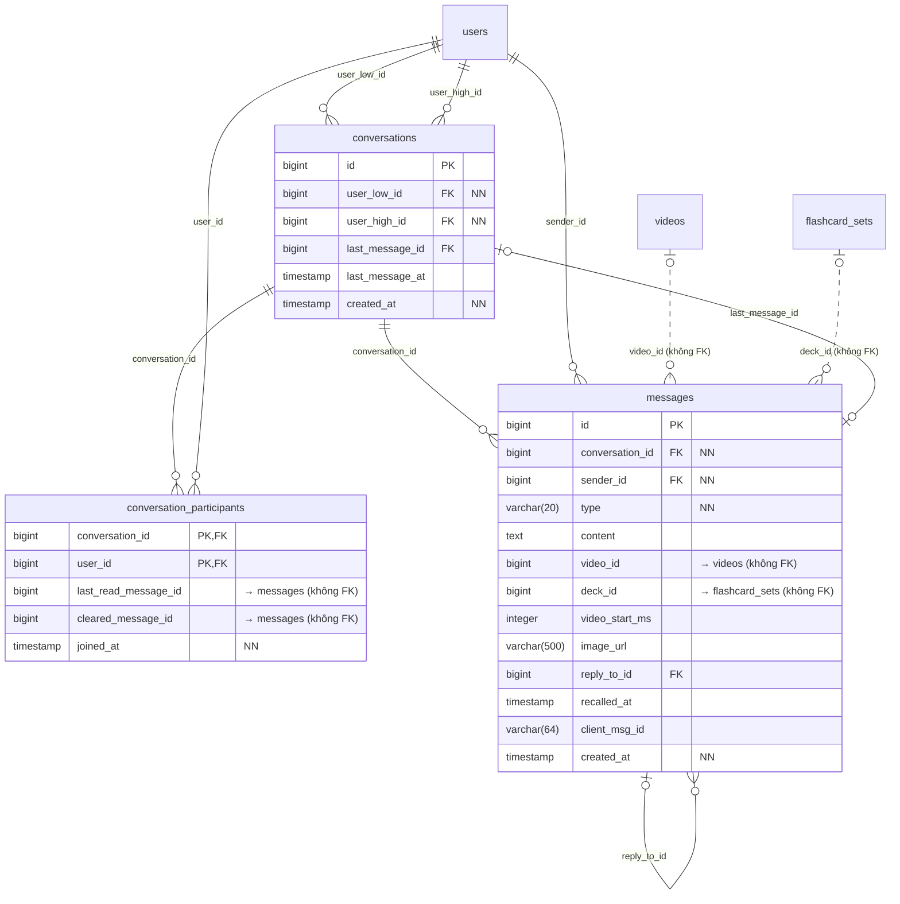
```mermaid
erDiagram
    conversations {
        bigint id PK
        bigint user_low_id FK "NN"
        bigint user_high_id FK "NN"
        bigint last_message_id FK
        timestamp last_message_at
        timestamp created_at "NN"
    }
    conversation_participants {
        bigint conversation_id PK, FK
        bigint user_id PK, FK
        bigint last_read_message_id "→ messages (không FK)"
        bigint cleared_message_id "→ messages (không FK)"
        timestamp joined_at "NN"
    }
    messages {
        bigint id PK
        bigint conversation_id FK "NN"
        bigint sender_id FK "NN"
        varchar(20) type "NN"
        text content
        bigint video_id "→ videos (không FK)"
        bigint deck_id "→ flashcard_sets (không FK)"
        integer video_start_ms
        varchar(500) image_url
        bigint reply_to_id FK
        timestamp recalled_at
        varchar(64) client_msg_id
        timestamp created_at "NN"
    }
    users ||--o{ conversations : user_low_id
    users ||--o{ conversations : user_high_id
    conversations ||--o{ messages : conversation_id
    users ||--o{ messages : sender_id
    messages |o--o{ messages : reply_to_id
    messages |o--o| conversations : last_message_id
    conversations ||--o{ conversation_participants : conversation_id
    users ||--o{ conversation_participants : user_id
    videos |o..o{ messages : "video_id (không FK)"
    flashcard_sets |o..o{ messages : "deck_id (không FK)"
```

### Gói thành viên & thanh toán

_5 bảng; ô không có cột là bảng của nhóm khác._

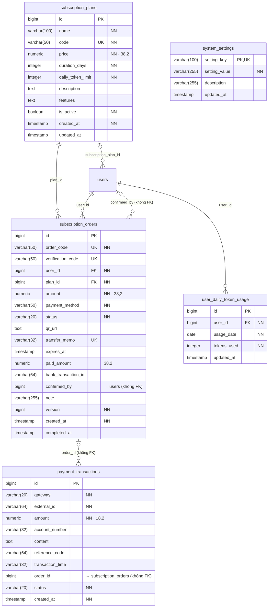
```mermaid
erDiagram
    subscription_plans {
        bigint id PK
        varchar(100) name "NN"
        varchar(50) code UK "NN"
        numeric price "NN · 38,2"
        integer duration_days "NN"
        integer daily_token_limit "NN"
        text description
        text features
        boolean is_active "NN"
        timestamp created_at "NN"
        timestamp updated_at
    }
    subscription_orders {
        bigint id PK
        varchar(50) order_code UK "NN"
        varchar(50) verification_code UK
        bigint user_id FK "NN"
        bigint plan_id FK "NN"
        numeric amount "NN · 38,2"
        varchar(50) payment_method "NN"
        varchar(20) status "NN"
        text qr_url
        varchar(32) transfer_memo UK
        timestamp expires_at
        numeric paid_amount "38,2"
        varchar(64) bank_transaction_id
        bigint confirmed_by "→ users (không FK)"
        varchar(255) note
        bigint version "NN"
        timestamp created_at "NN"
        timestamp completed_at
    }
    payment_transactions {
        bigint id PK
        varchar(20) gateway "NN"
        varchar(64) external_id "NN"
        numeric amount "NN · 18,2"
        varchar(32) account_number
        text content
        varchar(64) reference_code
        varchar(32) transaction_time
        bigint order_id "→ subscription_orders (không FK)"
        varchar(20) status "NN"
        timestamp created_at "NN"
    }
    user_daily_token_usage {
        bigint id PK
        bigint user_id FK "NN"
        date usage_date "NN"
        integer tokens_used "NN"
        timestamp updated_at
    }
    system_settings {
        varchar(100) setting_key PK, UK
        varchar(255) setting_value "NN"
        varchar(255) description
        timestamp updated_at
    }
    subscription_plans |o--o{ users : subscription_plan_id
    subscription_plans ||--o{ subscription_orders : plan_id
    users ||--o{ subscription_orders : user_id
    subscription_orders |o..o{ payment_transactions : "order_id (không FK)"
    users ||--o{ user_daily_token_usage : user_id
    users |o..o{ subscription_orders : "confirmed_by (không FK)"
```

### Báo cáo & thông báo

_2 bảng; ô không có cột là bảng của nhóm khác._

```mermaid
erDiagram
    reports {
        bigint id PK
        bigint reporter_id FK "NN"
        varchar(20) target_type "NN"
        bigint target_id "NN"
        varchar(30) reason "NN"
        varchar(500) detail
        varchar(20) status "NN"
        varchar(20) action
        bigint resolved_by "→ users (không FK)"
        timestamp resolved_at
        varchar(500) resolution_note
        timestamp created_at "NN"
    }
    notifications {
        bigint id PK
        bigint recipient_id FK "NN"
        bigint actor_id FK
        varchar(30) type "NN"
        bigint video_id "→ videos (không FK)"
        bigint comment_id "→ video_comments (không FK)"
        varchar(500) message
        boolean is_read "NN"
        timestamp created_at "NN"
    }
    users ||--o{ reports : reporter_id
    users ||--o{ notifications : recipient_id
    users |o--o{ notifications : actor_id
    videos |o..o{ notifications : "video_id (không FK)"
    video_comments |o..o{ notifications : "comment_id (không FK)"
    users |o..o{ reports : "resolved_by (không FK)"
```

## Ghi chú vật lý

- **Xóa mềm:** Cột deleted_at có ở videos, video_comments, video_likes, video_saves, shadowing_practice và shadowing_line_attempts. Hibernate tự thêm điều kiện deleted_at IS NULL khi đọc các bảng này (SQL thuần hoặc native query thì không có điều kiện đó).
- **Khóa chính:** Hầu hết là bigint tự tăng. Ngoại lệ: khóa phức hợp ở bảng nối; user_streaks dùng user_id; system_settings dùng setting_key.
- **Enum:** Lưu dạng chuỗi (varchar), danh sách giá trị ở bảng bên dưới; DB không có ràng buộc CHECK cho các cột này.
- **Chống trùng:** conversations (user_low_id, user_high_id) là duy nhất với id nhỏ đứng trước; messages (sender_id, client_msg_id) chống gửi trùng khi mạng chập chờn; payment_transactions (gateway, external_id) chống xử lý lại cùng một webhook.
- **Khóa lạc quan:** subscription_orders.version dùng để tránh hai luồng cùng cập nhật một đơn.
- **Báo cáo đa hình:** reports.target_type kết hợp target_id trỏ tới videos, video_comments hoặc users tùy loại, nên không có khóa ngoại.
- **Chủ đề và hashtag:** video_topics, hashtags và video_hashtags đến từ nhánh dev (chưa gộp vào nhánh hiện tại). Cột cũ videos.topic_id vẫn còn trong DB để các nhánh chưa cập nhật chạy được và sẽ bị bỏ sau.
- **Bảng không dùng:** Bảng roles còn trong code nhưng không có quan hệ; phân quyền dùng cột users.role (enum).

### Chỉ mục và ràng buộc duy nhất

| Bảng | Chỉ mục | Duy nhất |
|---|---|---|
| `comment_likes` | (comment_id) | — |
| `conversations` | — | (user_low_id,user_high_id) |
| `device_tokens` | (user_id) | — |
| `follows` | (following_id) | — |
| `hashtags` | — | (name) |
| `messages` | (conversation_id, id) | (sender_id,client_msg_id) |
| `notifications` | (recipient_id, created_at); (recipient_id, is_read) | — |
| `payment_transactions` | — | (gateway,external_id) |
| `reports` | (status, created_at); (target_type, target_id) | — |
| `shadowing_line_attempts` | (user_id, video_id) | — |
| `subscription_orders` | — | (order_code); (verification_code); (transfer_memo) |
| `subscription_plans` | — | (code) |
| `system_settings` | — | (setting_key) |
| `topics` | — | (name) |
| `user_blocks` | (blocked_id) | — |
| `user_daily_token_usage` | — | (user_id,usage_date) |
| `users` | — | (username); (email); (google_sub) |
| `video_comments` | (video_id); (parent_id) | — |
| `video_hashtags` | (hashtag_id, video_id) | — |
| `video_topics` | (topic_id, video_id) | — |
| `videos` | (status, mod_status, created_at); (user_id, created_at); (deleted_at) | — |

### Giá trị enum

| Cột | Giá trị |
|---|---|
| `users.auth_provider` | LOCAL, GOOGLE |
| `users.role` | ADMIN, USER, MODERATOR |
| `users.jlpt_level · videos.jlpt_level` | N5, N4, N3, N2, N1 |
| `videos.status` | PUBLIC, PRIVATE, UNLISTED, DRAFT |
| `videos.mod_status` | PENDING, APPROVED, REJECTED, DRAFT |
| `messages.type` | TEXT, VIDEO_SHARE, IMAGE, DECK_SHARE |
| `notifications.type` | LIKE, COMMENT, REPLY, FOLLOW, VIDEO_APPROVED, VIDEO_REJECTED, REPORT_UPDATE, CONTENT_REMOVED |
| `reports.target_type` | VIDEO, COMMENT, USER |
| `reports.reason` | SPAM, INAPPROPRIATE, HARASSMENT, MISINFORMATION, COPYRIGHT, OTHER |
| `reports.status` | PENDING, RESOLVED, DISMISSED |
| `reports.action` | NONE, HIDE_VIDEO, DELETE_COMMENT, LOCK_USER |
| `subscription_orders.status` | PENDING, SUCCESS, FAILED, EXPIRED, CANCELLED, NEEDS_REVIEW |
| `payment_transactions.status` | UNMATCHED, MATCHED, UNDERPAID, LATE, EXTRA_PAYMENT |
| `flashcard_progress.srs_state` | NEW, LEARNING, REVIEW |

### Tham chiếu không có khóa ngoại

| Cột | Trỏ tới |
|---|---|
| `conversation_participants.cleared_message_id` | `messages` |
| `conversation_participants.last_read_message_id` | `messages` |
| `flashcard_sets.source_set_id` | `flashcard_sets` |
| `messages.deck_id` | `flashcard_sets` |
| `messages.video_id` | `videos` |
| `notifications.comment_id` | `video_comments` |
| `notifications.video_id` | `videos` |
| `payment_transactions.order_id` | `subscription_orders` |
| `reports.resolved_by` | `users` |
| `subscription_orders.confirmed_by` | `users` |
| `user_streak_days.user_id` | `users` |
| `user_streaks.user_id` | `users` |
| `videos.moderated_by` | `users` |
